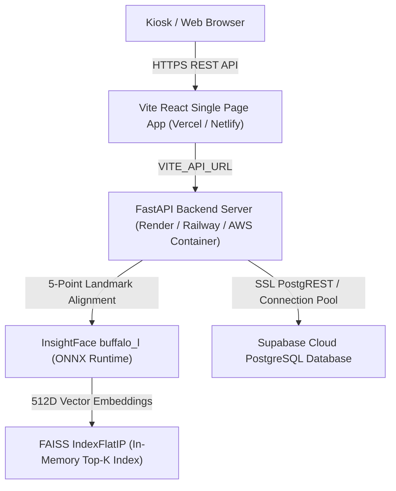

# FaceVote — Face-ID Electronic Voting Verification System

**FaceVote** is a production-ready, biometric electronic voting verification platform combining 512-dimensional facial recognition, multi-frame liveness detection, FAISS vector search, and anti-duplicate single-ballot enforcement.

---

## 🏛️ System Architecture



---

## 🛠️ Technology Stack

| Tier | Technology | Purpose |
| :--- | :--- | :--- |
| **Frontend** | React 18, Vite, Lucide Icons, Canvas API | High-speed client kiosk UI & video capture |
| **Backend API** | Python 3.11/3.13, FastAPI, Uvicorn, SlowAPI | Async API endpoints & rate-limiting |
| **Biometric Vision** | InsightFace (`buffalo_l`), ONNX Runtime, OpenCV | 5-Point facial alignment & 512D embeddings |
| **Vector Engine** | FAISS (`IndexFlatIP`), NumPy | Sub-millisecond Top-K cosine similarity search |
| **Database** | Supabase Cloud PostgreSQL / Local SQLite | Voter registry, multi-template vector storage, ballots |
| **Deployment** | Vercel (Frontend), Render / Container (Backend) | Production hosting & cloud scaling |

---

## 🚀 Quick Start Guide (Local Development)

### Prerequisites
* **Python**: `3.11` (Recommended) or `3.13`
* **Node.js**: `v18+` & `npm`
* **Git**

### 1. Clone Repository & Setup Environment
```bash
git clone https://github.com/BhanuTejapothuru01/Face-ID-e-voting-verification.git
cd Face-ID-e-voting-verification

# Configure environment files
cp backend/.env.example backend/.env
cp frontend/.env.example frontend/.env
```

### 2. One-Click Launch (Recommended)
```bash
# macOS / Linux
chmod +x start.sh && ./start.sh

# Windows
start.bat
```

### 3. Manual Launch

#### Backend API:
```bash
cd backend
python3 -m venv venv
source venv/bin/activate  # On Windows: venv\Scripts\activate
pip install -r requirements.txt
python -m uvicorn app.main:app --host 0.0.0.0 --port 8000 --reload
```

#### Frontend Web Kiosk:
```bash
cd frontend
npm install
npm run dev
```

Visit **http://localhost:5173** in your browser.

---

## 🔑 Environment Variables

### Backend (`backend/.env`)
| Variable | Default | Description |
| :--- | :--- | :--- |
| `PORT` | `8000` | Server listening port |
| `CORS_ORIGINS` | `http://localhost:5173` | Allowed origins (comma-separated) |
| `ADMIN_SECRET` | `602142` | Administrative passcode |
| `SIMILARITY_THRESHOLD` | `0.68` | Minimum similarity score required for identity match |
| `SUPABASE_URL` | — | Supabase Cloud project URL |
| `SUPABASE_PUBLISHABLE_KEY` | — | Supabase publishable key |
| `SUPABASE_SECRET_KEY` | — | Supabase secret key |
| `SUPABASE_SERVICE_ROLE_KEY` | — | Supabase service-role key (Backend only) |

### Frontend (`frontend/.env`)
| Variable | Default | Description |
| :--- | :--- | :--- |
| `VITE_API_URL` | `http://127.0.0.1:8000` | Production backend base URL |

---

## 🗄️ Database Setup (Supabase Cloud)

1. Create a project at [Supabase](https://supabase.com).
2. Open the **SQL Editor** in Supabase.
3. Paste and run the schema script located at:
   📄 **[`scripts/supabase_schema.sql`](file:///Users/pothurubhanuteja/cvip%20project/FaceVote/scripts/supabase_schema.sql)**
4. Verify table creation by running:
   ```bash
   python scripts/setup_supabase_db.py
   ```

---

## 🌐 Production Deployment Architecture

### 1. Frontend (Vercel)
1. Import repository to Vercel.
2. Root directory: `frontend`
3. Build command: `npm run build`
4. Output directory: `dist`
5. Environment Variable:
   ```env
   VITE_API_URL=https://your-backend.render.com
   ```

### 2. Backend (Render / Railway / Docker)
1. Deploy as Web Service or Docker container.
2. Root directory: `backend`
3. Start command:
   ```bash
   uvicorn app.main:app --host 0.0.0.0 --port $PORT
   ```
4. Set Environment Variables (`SUPABASE_URL`, `SUPABASE_SECRET_KEY`, `CORS_ORIGINS=https://your-app.vercel.app`, etc.).

---

## 📑 API Endpoint Sitemap

| Method | Route | Description | Auth Required |
| :--- | :--- | :--- | :--- |
| `GET` | `/api/health` | Health & model status check | No |
| `POST` | `/api/register` | Multi-frame voter face registration | No |
| `POST` | `/api/verify` | Real-time multi-frame face verification | No |
| `GET` | `/api/voters` | List registered voters | Admin Bearer |
| `POST` | `/api/admin/login` | Admin passcode authentication | No |
| `GET` | `/api/admin/sessions` | Retrieve active voting sessions | Admin Bearer |
| `POST` | `/api/admin/sessions` | Create or toggle voting session | Admin Bearer |
| `POST` | `/api/voting/cast-vote` | Single-ballot vote submission | Single-use Token |

---

## 🧪 Accuracy Benchmark & Testing

Run the automated evaluation benchmark to measure Genuine Acceptance Rate (GAR), False Rejection Rate (FRR), and False Acceptance Rate (FAR):

```bash
# Run Biometric Accuracy Benchmark Script
backend/venv/bin/python backend/scripts/evaluate_face_recognition.py

# Run Automated Unit Test Suite
backend/venv/bin/python -m unittest discover -s backend/tests
```

---

## 🔒 Security & Privacy Features

* **Zero Persistent Image Storage**: Verification video frames are processed 100% in memory and immediately discarded.
* **Service-Role Isolation**: Supabase service-role credentials are restricted strictly to the FastAPI backend environment.
* **Single-Ballot Guarantee**: Voting session enforcement prevents duplicate votes per registered voter ID.
* **Outlier Discarding**: Noisy or misaligned registration frames are filtered out before centroid calculation.
